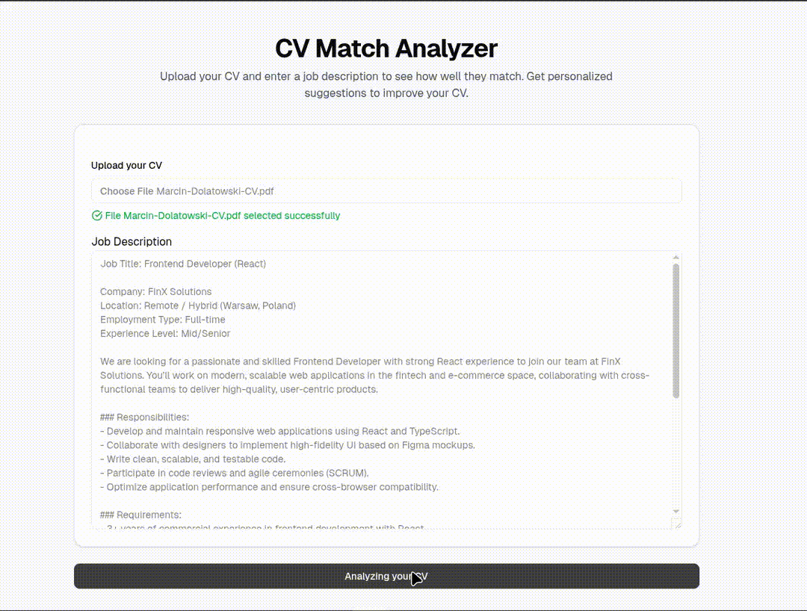

# 🚀 Boost Your CV

**Boost Your CV** is an AI-powered resume analyzer that helps you tailor your CV to specific job descriptions. It gives you:

- ✅ Match Percentage
- 💪 Strength Highlights
- 🛠️ Suggestions for Improvement

Powered by OpenAI's API, this app provides actionable insights to help you stand out in your job applications.

<p align="center">
  
</p>

---

## 🔍 Features

- Upload your **CV**
- Paste your **Job Description**
- Instantly see:
  - 📊 Match Percentage
  - 💡 Key Strengths
  - 🧠 Personalized Improvement Tips

---

## 🛠️ Built With

- **T3 Stack**:
  - Next.js
  - TypeScript
  - Tailwind CSS
  - Shadcn
  - TRPC
- **OpenAI API** for analysis

---

## 🔐 Requirements

- Node.js (v18+)
- Your own [OpenAI API key](https://platform.openai.com/account/api-keys)

---

## ⚙️ Getting Started

1. **Clone the repository:**

```bash
git clone https://github.com/yourusername/boost-your-cv
cd boost-your-cv
npm install
```

Create a .env file in the root directory and add your OpenAI key:
API_KEY=your_openai_api_key

```bash
npm run dev
```

The app will be available at http://localhost:3000
